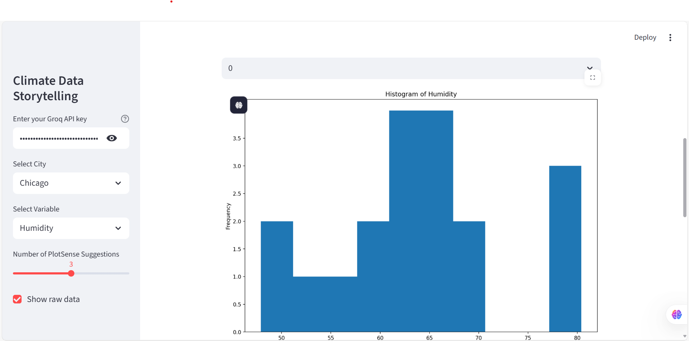

# PlotSense Data Storytelling App

An interactive Streamlit web app that uses **PlotSense AI** to recommend and explain visualizations for climate data.

This project was built as part of the PlotSense AI Hackathon to demonstrate how storytelling with data can be made simple and extensible.

## 🚀 Features
- Load a real climate dataset (climate.csv) with Temperature, Humidity, Wind Speed, Rainfall.

- Filter data by City and choose a variable of interest.

- Get AI-powered recommendations for visualizations using PlotSense.

- Preview raw data (first 10 rows) before visualization.

- Render visualizations directly inside the web app.

- Generate AI explanations for each chart using your Groq API key.

## 📂 Project Structure
```bash
plotsense-data-storytelling/
├── app.py                # Main Streamlit app
├── data/
│   └── climate.csv       # Sample climate dataset
├── requirements.txt      # Python dependencies
├── README.md             # Project documentation
└── assets/               # Store screenshots for README
```

## ⚙️ Installation & Setup
1. Clone this repository
```bash
git clone https://github.com/your-username/plotsense-data-storytelling.git
cd plotsense-data-storytelling
```

2. Create a virtual environment (recommended)
```bash
python -m venv .venv
source .venv/bin/activate   # macOS/Linux
.venv\Scripts\activate      # Windows
```

3. Install dependencies
```bash
pip install plotsense
pip install streamlit
pip install -r requirements.txt
```
This installs:
- plotsense (AI visualization tool)
- streamlit (for the web app)
- pandas (for data handling)

## ▶️ Running the App

From the project root, run:
```bash
python -m streamlit run app.py
```
Then open the local server URL shown in your terminal (usually http://localhost:8501
).

## 🔑 Groq API Key Setup

Some features (AI explanations) require a Groq API key:

1. Create a free account at Groq Console.

2. Copy your key (looks like gsk_xxxxx).

3. Paste it into the sidebar input box inside the Streamlit app.

 - The input is hidden (password-style).
 - Each participant can use their own key without editing code.

## 🖼️ Screenshots
```markdown

```